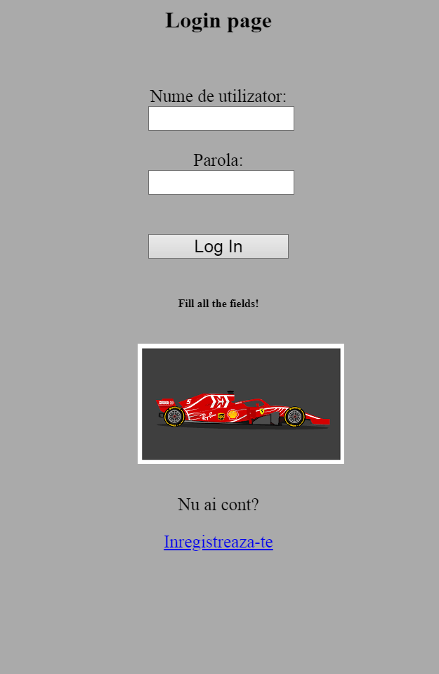
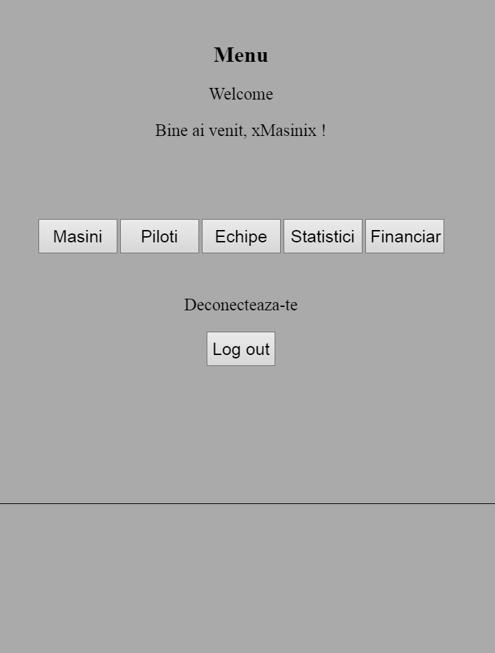
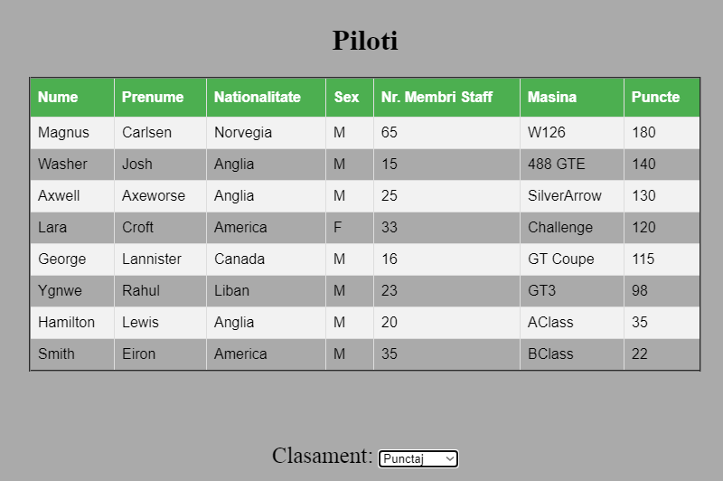
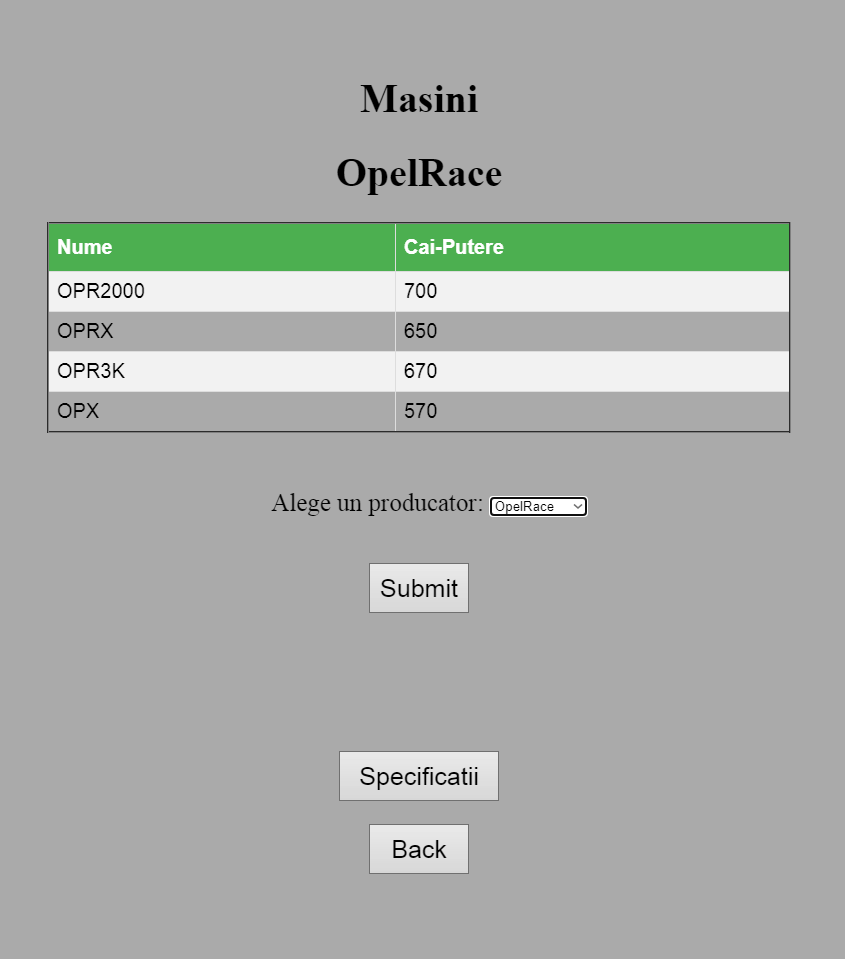
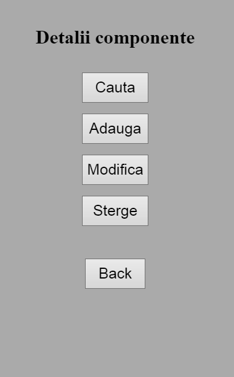
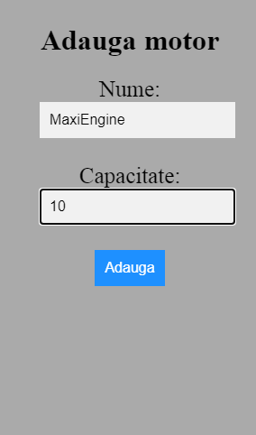
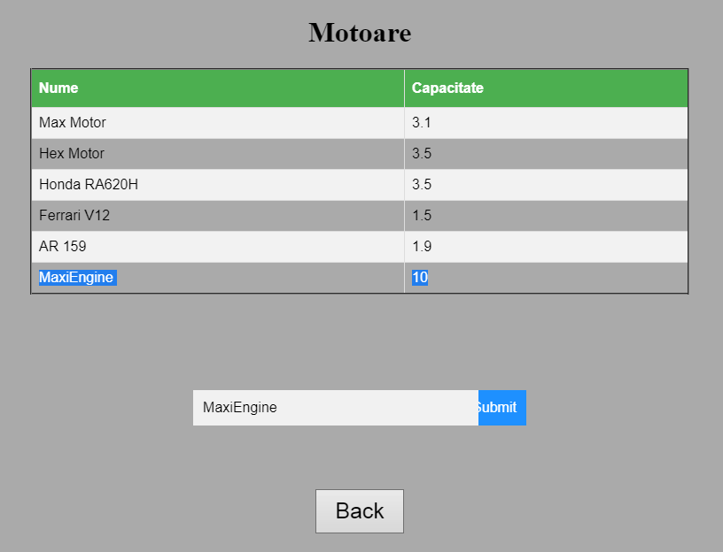
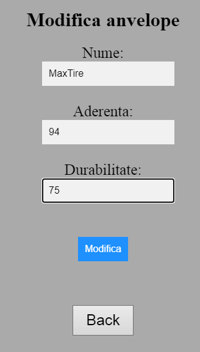
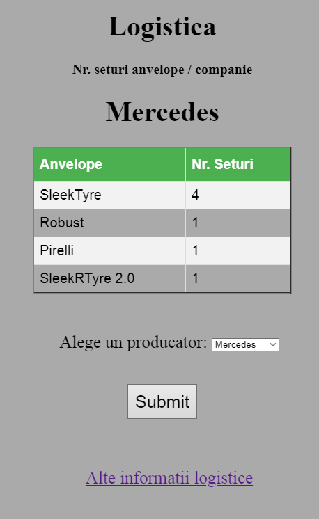
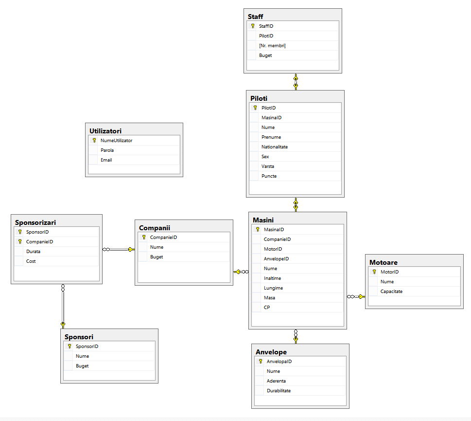

# Formula1-web-application

Web application using Microsoft SQL Server as a database management system, and PHP (for server scripting), along with basic HTML, CSS and JS for a user-friendly interface. I used XAMPP for a local web server.

The application can be scaled and used by a variety of employees who work within the championship (such as accountants or mechanics) and by regular users (fans of the sport) who can view and sort data. Currently, it features a "mechanic" type of a account, where the user can modify, add and delete car components and their specifications. Data is fetched or modified via queries.

Users can create an account and, depending on their type of access, can view, sort (by different criteria) and modify data (regarding cars, components, teams, budgets).

# Some of the features
## Login page

## Menu

## Data about pilots
Sorted by points

## Data about cars
Power and names (grouped by the company)

## Car component editor
A mechanic can search, add, modify and delete components accordingly

## Add component
The user can add engines and tires (depending on the submitted component choice)

## Search component

## Modify component

## Logistics example
The amount of tire sets each company has (of each kind)

## Diagram & Tables

### Diagram

### Tables
The database is comprised of the following tables:

- Pilots
- Companies
- Cars
- Sponsors
- Tires
- Engines
- Staff
- Users
- Sponsorships (resulted from the N:N relationship between Sponsors and Companies)
